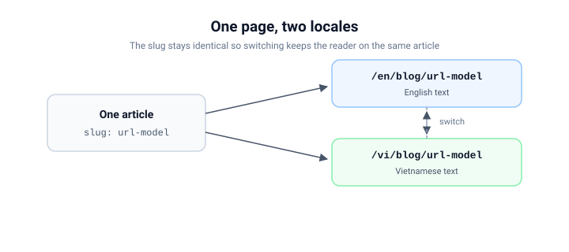

# Một mô hình URL cho mọi trang public

Mọi trang trên `ecoma.io` đều nằm dưới một hình dạng duy nhất:

```text
/<locale>/<mount>/<path>
```

Đó không phải một quy ước mà ta hy vọng các team tự tuân theo. Nó được parse,
bị từ chối và được dựng bởi hai thư viện nhỏ, nên một trang không thể lặng lẽ
lệch sang hình dạng mà phần còn lại của nền tảng không hiểu.


## Ba segment

- **locale** đứng đầu, luôn luôn: `/en/...` hoặc `/vi/...`. Không có biến thể
  không prefix, nên một URL không bao giờ phải tự đoán ngôn ngữ của nó.
- **mount** gọi tên bề mặt: `blog`, `docs`. Mount match trên biên segment đầy
  đủ - `/en/blogging` **không phải** blog.
- **path** là mọi thứ sau mount, và nó thuộc về app sở hữu mount đó.

## Nghiêm ngặt là một tính năng

Parser không sửa chữa input. Trailing slash, segment rỗng, hay locale lạ đều
bị từ chối kèm reason có kiểu:

```text
/en        -> ok
/en/docs/  -> bị chặn: trailing slash
/EN/docs   -> bị chặn: locale không hỗ trợ
/en//docs  -> bị chặn: segment rỗng
```

"Sửa giúp" nghe có vẻ tử tế nhưng âm thầm có hại: một URL "chạy được" ở dạng
không canonical sẽ bị index, bị cache và được chia sẻ đúng ở dạng đó. Từ chối
giữ cho mỗi trang đúng một địa chỉ canonical.

## Slug sống sót qua bản dịch

Một article giữ nguyên slug ở cả hai ngôn ngữ. `/en/blog/url-model` và
`/vi/blog/url-model` là cùng một resource mang hai ngôn ngữ, nên locale
switcher chuyển reader qua lại giữa chúng mà không cần bảng tra cứu.



---

_Liên quan: bề mặt docs mô tả cùng mô hình này sâu hơn - xem
[Các tầng của public web](/en/blog/build-time-content) để biết content đến trang
theo đường nào._
