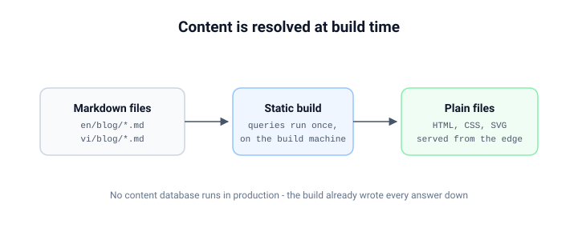

# Content được resolve ở build time

Khi bạn mở một article ở đây, không server nào hỏi database rằng article đó
nói gì. Câu trả lời đã được ghi xuống - thành một file HTML thuần - ngay lúc
site được build.

## Pipeline

1. **Viết** - một article là một file Markdown có frontmatter, đặt cạnh ảnh
   của chính nó.
2. **Build** - static build chạy mọi content query đúng một lần, trên máy
   build: listing, article featured, link trước/sau.
3. **Phục vụ** - edge phục vụ file. Không có gì render theo từng request.

## Điều đó mua được gì

| Mối quan tâm    | Câu trả lời tĩnh                        |
| --------------- | --------------------------------------- |
| Độ trễ          | CDN cache hit, không origin render      |
| Tính sẵn sàng   | Site sống sót cả khi database chết      |
| Mô hình chi phí | Phục vụ file, không chạy compute        |
| Đúng content    | Bạn đăng gì thì nó phục vụ đúng điều đó |

Bảng trên là danh sách trung thực. Static generation không phải câu trả lời
đúng cho mọi bề mặt sản phẩm, nhưng với bề mặt đọc thì khó có gì vượt được.

## Thoả hiệp ta chấp nhận

Publish không còn tức thời: thay đổi content vào build kế tiếp. Với một blog,
đó là thoả hiệp đúng - một deploy mất vài phút, và đổi lại, đường đọc không
bao giờ phải chờ một query runtime.

> Một trang render từ file thì không thể có query chậm. Cả lớp sự cố đó đơn
> giản không tồn tại với nó.

---

_Bài [mô hình URL](/en/blog/url-model) nói về việc những file này kết thúc ở
những địa chỉ localized sạch thế nào._
