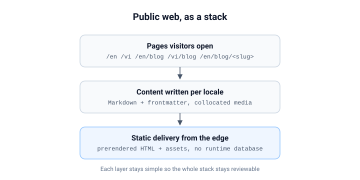

# Trang đọc bài không phải trang tài liệu

Nền tảng có một bề mặt tài liệu với layout ba cột: cây điều hướng, nội dung,
table of contents. Layout đó đúng cho tài liệu tra cứu và sai cho article.
Bài này nói về những khác biệt quan trọng.

## Phân cấp theo sự chú ý

Reader tài liệu scan để tìm một mục. Reader article dấn thân vào một dòng.
Nên trang article chỉ giữ một cột hẹp, đẩy điều hướng ra hai đầu đường đọc -
trước, sau, bài liên quan - và đứng sang một bên ở giữa chừng.

## Bề rộng là một quyết định đọc

Một dòng văn chạy quá rộng làm mắt lạc ở mỗi lần quét về đầu dòng. Cột article
bị chặn ở một bề rộng chọn cho văn xuôi, không phải cho terminal. Code block
có scroll ngang riêng thay vì kéo giãn cột cho mọi reader chỉ vì một dòng dài.

## Tiết chế ở phần đầu

| Trang docs          | Trang article      |
| ------------------- | ------------------ |
| Table of contents   | không có           |
| Breadcrumb          | link về trang blog |
| Cây tham chiếu chéo | các bài liên quan  |

Không danh sách nào tốt hơn. Chúng trả lời hai câu hỏi khác nhau: _tôi đang ở
đâu trong tài liệu?_ và _nên đọc gì tiếp theo?_

## Một `<main>`, navigation có tên

Cả hai bề mặt dùng chung public shell, nên cả hai cùng thừa hưởng cùng một
sàn accessibility: một landmark `<main>` duy nhất, skip link, và mọi vùng
navigation mang một tên truy cập được phân biệt. Dùng chung shell là thứ làm
sàn đó trở nên miễn phí.

---

_Cơ chế đằng sau shared shell cũng chính là những cơ chế đằng sau [locale
switching](/en/blog/locale-switching)._
