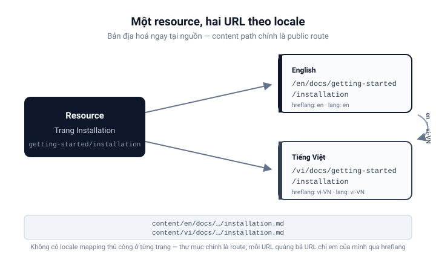

# Nội dung và ngôn ngữ

Nội dung tài liệu **bản địa hoá ngay tại nguồn**: mỗi trang tồn tại ở từng
locale, và content path ánh xạ trực tiếp sang public route.

## Nội dung bản địa hoá

Content của docs nằm trong `apps/docs/content`:

```text
content/
├── en/
│   └── docs/
│       └── getting-started/
│           └── installation.md
└── vi/
    └── docs/
        └── getting-started/
            └── installation.md
```

Mỗi locale có **bản riêng** của mọi trang, viết tự nhiên theo ngôn ngữ đó —
không phải bản dịch máy từ ngôn ngữ kia.

## Content path → public route

File path dưới `content/<locale>` trở thành pathname công khai trùng khớp:

```text
content/en/docs/getting-started/installation.md
                  ↓
/en/docs/getting-started/installation

content/vi/docs/getting-started/installation.md
                  ↓
/vi/docs/getting-started/installation
```

**Không có** locale mapping thủ công ở từng trang — thư mục chính là route.



## URL tự chứa

Vì locale là một phần của URL, mỗi tài liệu có một địa chỉ canonical tự chứa.
Liên kết trong tài liệu luôn ở trong locale hiện tại:

```text
/en/docs/concepts/public-web   ← liên kết của người đọc tiếng Anh
/vi/docs/concepts/public-web   ← liên kết của người đọc tiếng Việt
```

## Navigation theo ngôn ngữ

Sidebar, breadcrumbs và previous/next của docs được sinh từ content tree
**lọc theo locale hiện tại**. Người đọc tiếng Anh chỉ thấy cây tiếng Anh; cây
tiếng Việt không rò rỉ vào, và prev/next không bao giờ nhảy qua locale.

## Báo cho search engine biết URL chị em

Vì một resource và các bản dịch của nó nằm ở các URL khác nhau, mỗi trang khai
báo các URL chị em bằng link `rel="alternate"` kèm `hreflang`. Registry trong
`libs/i18n-public` định nghĩa các tag BCP-47 — `en` cho tiếng Anh, `vi-VN` cho
tiếng Việt — và ứng dụng docs sinh một alternate link cho mọi locale **thực sự
có** document đó. Một trang chỉ tồn tại bằng tiếng Anh sẽ không quảng bá
alternate tiếng Việt nào, nên search engine không bao giờ bị trỏ tới một 404.

Cùng registry đó điều khiển bộ chuyển đổi ngôn ngữ ở header: chuyển locale giữ
nguyên resource hiện tại và chỉ thay segment đầu của URL, nên
`/en/docs/getting-started/installation` trở thành
`/vi/docs/getting-started/installation` — không bao giờ rơi về trang chủ docs.

---

_Trước: [Web công khai](/vi/docs/concepts/public-web) · Tiếp: [Hướng dẫn](/vi/docs/guides)_
