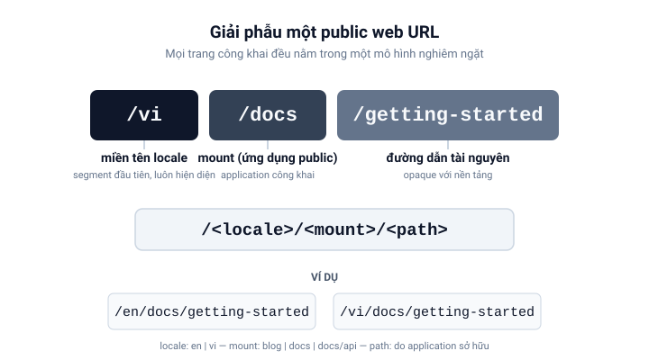

# Web công khai

Bề mặt công khai của `ecoma.io` tuân theo một mô hình URL duy nhất:

```text
/<locale>/<mount>/<path>
```



## Ba segment

- **locale** — segment đầu tiên, luôn hiện diện. Các locale được hỗ trợ nằm
  trong locale registry (`PUBLIC_LOCALES` trong `libs/i18n-public`). Tiếng Anh
  là `/en/...`, tiếng Việt là `/vi/...`; không có biến thể không prefix.
- **mount** — application công khai. Các mount hiện có trong `libs/layout-public`
  là `blog`, `docs` và `docs/api`. Mount khớp theo full segment boundary:
  `/en/docs` là `docs`, còn `/en/blogging` không phải `blog`.
- **path** — phần sau mount. Nó opaque với nền tảng; application sở hữu mount
  quyết định resource đó có tồn tại hay không.

## Ví dụ

| URL                                     | Nghĩa                           |
| --------------------------------------- | ------------------------------- |
| `/en`                                   | Locale root tiếng Anh           |
| `/en/docs`                              | Docs tiếng Anh, docs root       |
| `/en/docs/getting-started`              | Docs tiếng Anh, Getting Started |
| `/vi/docs/getting-started/installation` | Docs tiếng Việt, trang Cài đặt  |

## Parse nghiêm ngặt

Path **không** được normalize hay sửa giúp. Trailing slash, empty segment, hay
locale không được hỗ trợ đều bị từ chối với lý do đã định kiểu (typed reason)
thay vì âm thầm sửa:

```text
/en        → localized (en)
/EN/docs   → invalid (unsupported_locale)
/en/docs/  → invalid (trailing_slash)
/en//docs  → invalid (empty_segment)
```

## Ranh giới

- `/` là locale-resolution entry point. Nó không phục vụ nội dung và không tự
  redirect; policy resolve thuộc về caller.
- `docs/api` là mount lồng nhau với deployment unit riêng. Ứng dụng docs không
  phục vụ nó — request tới `/en/docs/api` bị từ chối trước khi lookup content.

## Mô hình nằm ở đâu

Mô hình URL không phải là một quy ước mà mỗi application tự tuân theo — nó được
thực thi trong hai library nhỏ mà mọi public application đều phụ thuộc vào:

- `libs/i18n-public` sở hữu **locale dimension**: registry `PUBLIC_LOCALES`,
  parse segment đầu tiên và locale switching. Nó không biết gì về mount hay
  application.
- `libs/layout-public` sở hữu **mount topology**: registry `PUBLIC_MOUNTS`
  (`blog`, `docs`, `docs/api`), khớp một pathname với một mount và dựng liên
  kết ngược lại.

Thêm một locale hay một mount nghĩa là thêm một entry vào registry tương ứng;
phần còn lại của nền tảng suy ra từ chính dữ liệu đó.

---

_Tiếp: [Nội dung và ngôn ngữ](/vi/docs/concepts/content-and-locales)_
