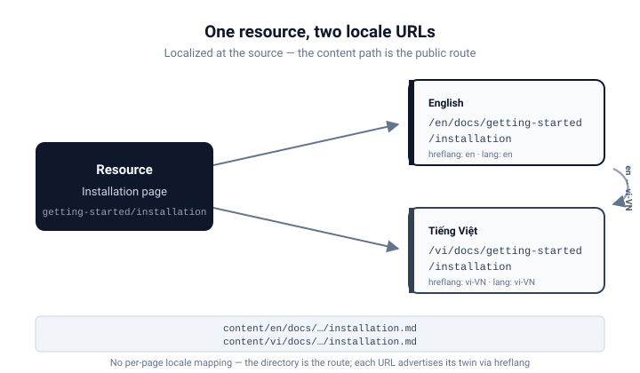

# Content and Locales

Documentation content is **localized at the source**: every page exists in each
locale, and the content path maps directly to the public route.

## Localized content

The docs content lives in `apps/home/content`:

```text
content/
├── en/
│   └── docs/
│       └── getting-started/
│           └── installation.md
└── vi/
    └── docs/
        └── getting-started/
            └── installation.md
```

Each locale has its **own copy** of every page, written to read naturally in
that language — not a machine translation of the other.

## Content path → public route

The file path under `content/<locale>` becomes the public pathname exactly:

```text
content/en/docs/getting-started/installation.md
                  ↓
/en/docs/getting-started/installation

content/vi/docs/getting-started/installation.md
                  ↓
/vi/docs/getting-started/installation
```

There is **no per-page locale mapping** — the directory is the route.



## Self-contained URLs

Because the locale is part of the URL, every document has a self-contained
canonical address. Links within the documentation stay inside the current
locale:

```text
/en/docs/concepts/public-web   ← English reader's link
/vi/docs/concepts/public-web   ← Vietnamese reader's link
```

## Locale-aware navigation

The docs sidebar, breadcrumbs and previous/next navigation are derived from the
content tree **filtered to the current locale**. An English reader sees only the
English tree; the Vietnamese tree never leaks in, and prev/next never jumps
across locales.

## Telling search engines about the twin

Because a resource and its translations live at different URLs, each page
declares its twins with `rel="alternate"` `hreflang` links. The registry in
`app/i18n` defines the BCP-47 tags — `en` for English, `vi-VN` for
Vietnamese — and the docs app emits an alternate link for every locale that
**actually has** the same document. A page that exists only in English
advertises no Vietnamese alternate, so search engines are never pointed at a 404.

The same registry drives the language switcher in the header: switching locale
keeps the current resource and swaps only the first URL segment, so
`/en/docs/getting-started/installation` becomes
`/vi/docs/getting-started/installation` — never the docs home.

---

_Previous: [Public Web](/en/docs/concepts/public-web) · Next: [Guides](/en/docs/guides)_
