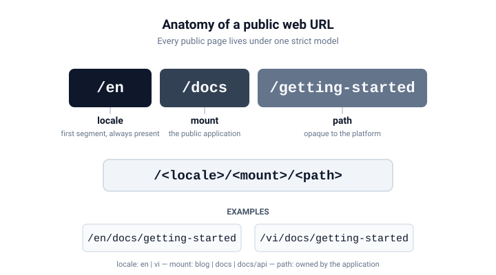

# Public Web

The public surface of `ecoma.io` follows one strict URL model:

```text
/<locale>/<mount>/<path>
```



## The three segments

- **locale** — the first segment, always present. Supported locales live in the
  locale registry (`PUBLIC_LOCALES` in `app/i18n`). English is
  `/en/...`, Vietnamese is `/vi/...`; there is no unprefixed variant.
- **mount** — the public application. Currently registered mounts in
  `app/layout` are `blog`, `docs` and `docs/api`. A mount matches on a
  full segment boundary: `/en/docs` is `docs`, while `/en/blogging` is not
  `blog`.
- **path** — everything after the mount. It is opaque to the platform; the
  application that owns the mount decides whether the resource exists.

## Examples

| URL                                     | Meaning                            |
| --------------------------------------- | ---------------------------------- |
| `/en`                                   | English locale root                |
| `/en/docs`                              | English docs, docs root            |
| `/en/docs/getting-started`              | English docs, Getting Started      |
| `/vi/docs/getting-started/installation` | Vietnamese docs, Installation page |

## Parsing is strict

Paths are **not** normalized or repaired. A trailing slash, an empty segment,
or an unsupported locale are rejected with a typed reason rather than being
silently fixed:

```text
/en        → localized (en)
/EN/docs   → invalid (unsupported_locale)
/en/docs/  → invalid (trailing_slash)
/en//docs  → invalid (empty_segment)
```

## Boundaries

- `/` is a locale-resolution entry point. It never serves content and never
  redirects to an unprefixed path on its own; the caller decides the policy.
- `docs/api` is a nested mount reserved for the `api-reference` surface. The
  home application does not serve it — a request for `/en/docs/api` is rejected
  before content lookup.

## Where the model lives

The URL model is not a convention that each page re-follows — it is enforced in
two small modules of `apps/home` that every public surface goes through:

- `app/i18n` owns the **locale dimension**: the `PUBLIC_LOCALES` registry,
  parsing the first segment and locale switching. It knows nothing about mounts
  or applications.
- `app/layout` owns the **mount topology**: the `PUBLIC_MOUNTS` registry
  (`blog`, `docs`, `docs/api`), matching a pathname to a mount and building
  links back.

Adding a locale or a mount means adding one entry to the corresponding
registry; the rest of the platform derives from that data.

---

_Next: [Content and Locales](/en/docs/concepts/content-and-locales)_
